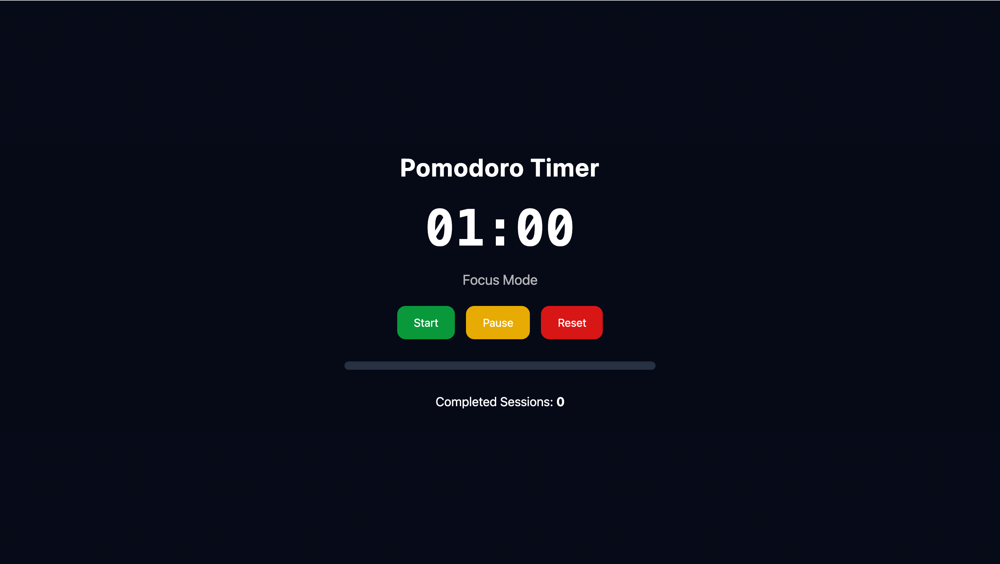

## Pomodoro Timer

A clean and minimalist Pomodoro Timer built using JavaScript, HTML, and TailwindCSS.
It includes start, pause, reset functionality, a progress bar, automatic mode switching, session tracking using localStorage, and an alarm when the session completes.

## Features
Focus and Break Cycles

Automatically switches between Focus Mode and Break Time.

## Default values:

Focus: 25 minutes (set to 1 minute for demo)

Break: 5 minutes

Real-Time Countdown

Countdown displayed in MM:SS format

Large, readable timer for better visibility

Interactive Controls

Start, Pause, Reset

Smooth hover animations using TailwindCSS

Progress Bar

Visual progress bar that fills as the session progresses

Session Tracking

Number of completed focus sessions saved to localStorage

Counter persists even after refresh

Alarm Notification

Plays an alarm sound at the end of each session

## Project Structure
/project-folder
│── index.html
│── script.js
│── assets/
│     └── alarm.wav
│── README.md

## Technologies Used

HTML5

TailwindCSS (CDN)

Vanilla JavaScript

localStorage API

Preview

How to Run

## Clone or download the project:

git clone <your-repo-url>

Open the project folder and run the HTML file in any browser:

index.html

No additional setup or dependencies are required.

Configuration

You can adjust the timer durations inside script.js:

const WORK_TIME = 25 * 60;
const BREAK_TIME = 5 * 60;

Modify these to change the default timings.